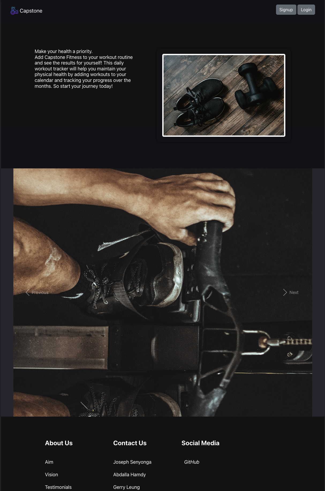
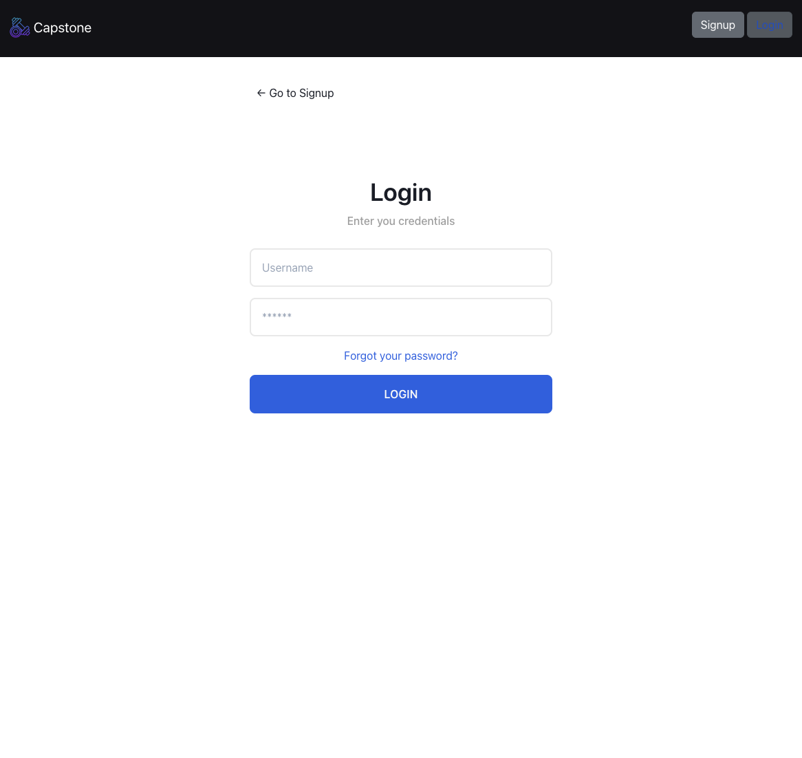
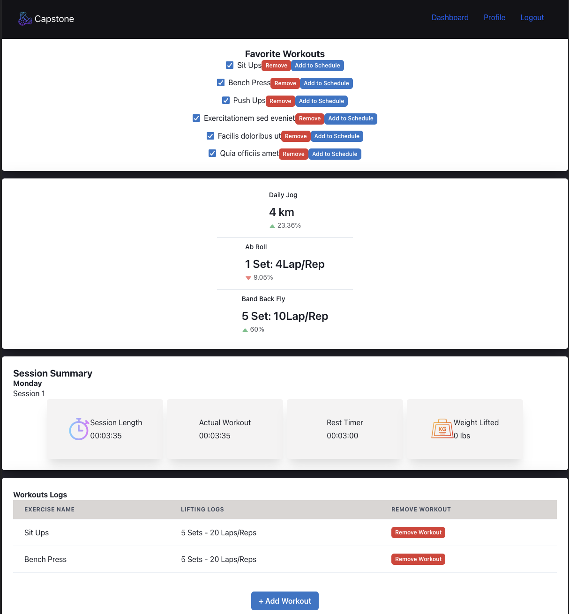

# Personal Workout Tracker

## Description

This is an application where a user can add workouts and track daily workout sessions.

## Table of Contents

- [Installation Instructions](#installation)
- [Live Link](#live-link)
- [Screenshots](#screenshots)
- [Contributors](#contributors)
- [Questions](#questions)

## Installation

1. In the root directory of the project
2. Run the the command

   - npm i

## Live Link

website link

## Screenshots

## Contributors

[joesen-dev](https://github.com/joesen-dev)
[bebo96](https://github.com/bebo96)
[abdallahamdy](https://github.com/abdallahamdy)
[leunggerry](https://github.com/leunggerry)

## Questions

If you have any questions regarding the status of this project or any concerns please refer to our GitHub repo:

[joesen-dev](https://github.com/joesen-dev)
[bebo96](https://github.com/bebo96)
[abdallahamdy](https://github.com/abdallahamdy)
[leunggerry](https://github.com/leunggerry)
